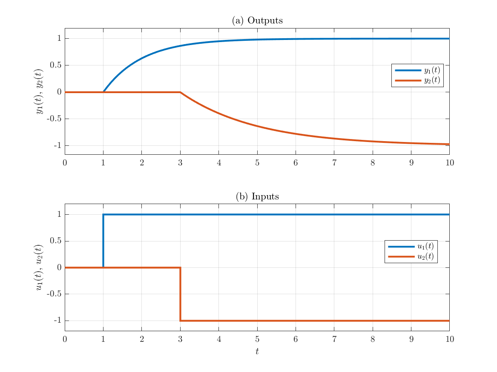
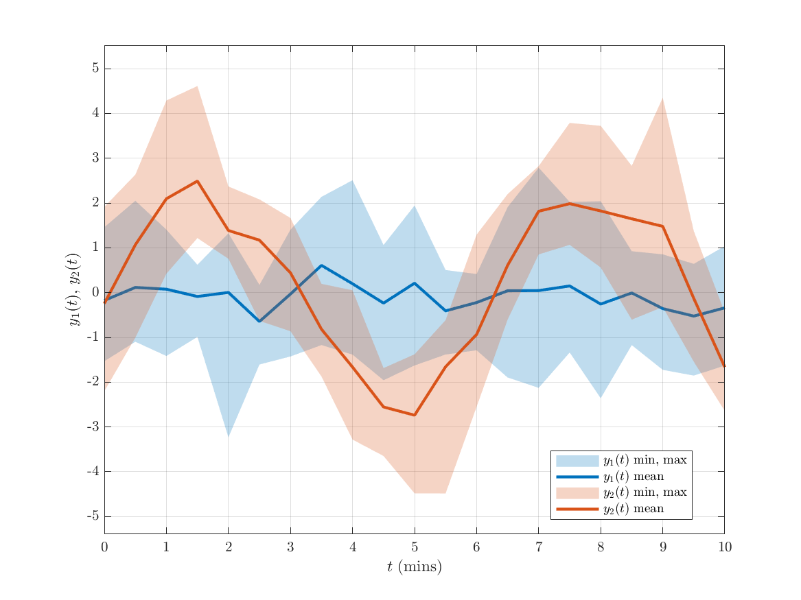
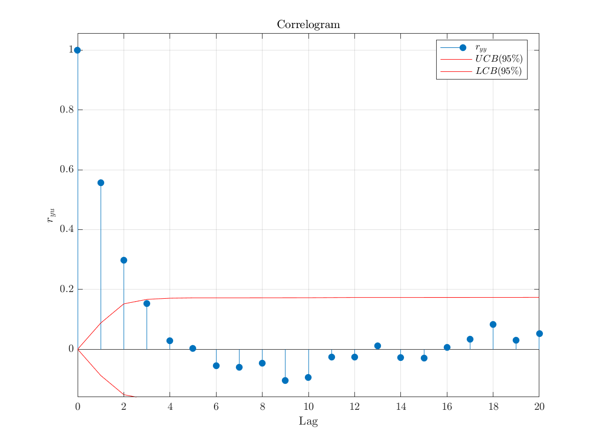
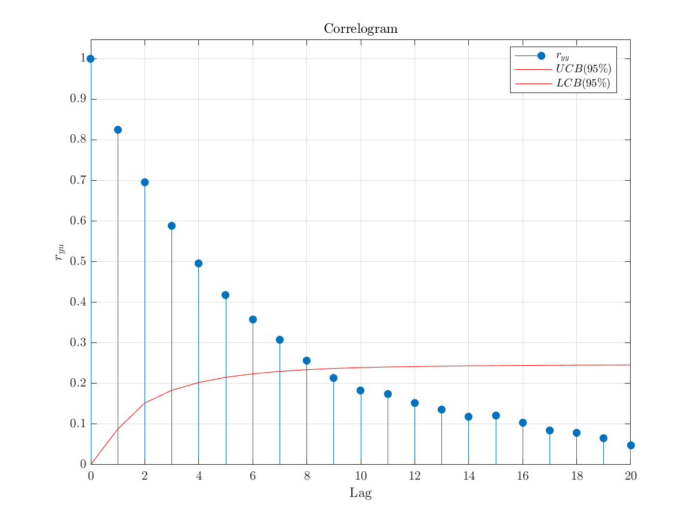
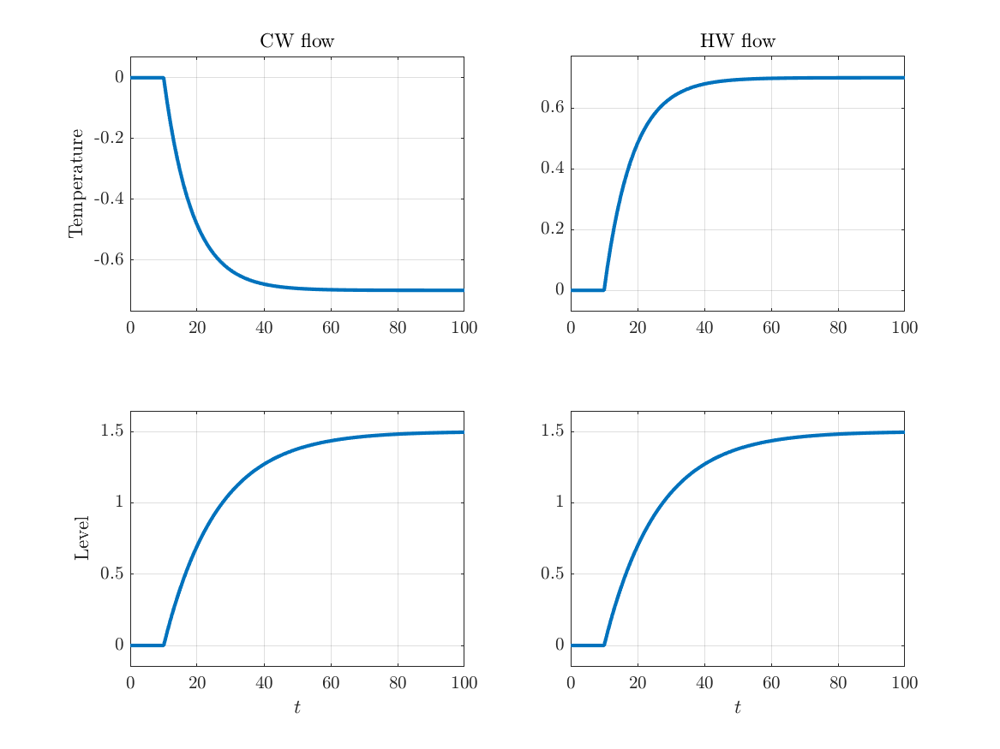

# ml-plot-utils
MATLAB scripts to facilitate common plotting tasks for data from dynamical systems simulations.  All the plots use Latex fonts.

## Examples

### 1. Input-output plots for a dynamic system

```lang-matlab
% Simulate continuous-time 2x2 system
t = linspace(0, 10, 101)';
nT = size(t, 1) - 1;
U = zeros(nT+1,2);
U(t >= 1, 1) = 1;
U(t >= 3, 2) = -1;
G = [tf(1, [1 1]) 0;
     0            tf(1, [2 1])];
[Y, t] = lsim(G,U,t);
u_labels = {'$u_1(t)$', '$u_2(t)$'};  % or ["$u_1(t)$" "$u_2(t)$"]
y_labels = {'$y_1(t)$', '$y_2(t)$'};

% Make input-output plot
figure
make_ioplot(Y, t, U, u_labels, y_labels)

% Save plot as pdf file
save_fig_to_pdf('plots/ioplot3.pdf')
```



### 2. Time-series plot of the statistics of a group of signals.

```lang-matlab
% Generate two groups of 10 random signals
t = 0.5*(0:20)';
Y = {randn(21, 10), randn(21, 10)+2*sin(t)};

% Make statistics plot
figure
y_labels = {'$y_1(t)$', '$y_2(t)$'};
make_tsstatplot(Y, t, y_labels, '$t$ (mins)', nan(2), 'minmax', 'mean')

% Save plot as pdf file
save_fig_to_pdf('plots/tsstatplot4.pdf')
```




### 3. Correlograms

Auto-correlogram plot with confidence bounds:

```lang-matlab
data = readtable('test_data/tsdata1.csv');

figure
plot_correlogram_auto_conf(data.y4)
save_fig_to_pdf('plots/corrplot1.pdf')
```



Cross-correlogram plot with confidence bounds:

```lang-matlab
data = readtable('test_data/tsdata2.csv');

figure
plot_correlogram_auto_conf(data.y2)
save_fig_to_pdf('plots/corrplot2.pdf')
```



### 4. Step response plots

Make a matrix of the step responses of SISO or MIMO linear systems. Similar 
to MATLAB's built-in `step` plot function but with more control over formatting
and labelling.

```lang-matlab
% Define 2x2 system
s = tf('s');
G11 = -0.7 / (1 + 8.5*s);
G12 = -G11;
G21 = 1.5 / (1 + 16*s);
G22 = G21;
Gc = [G11 G12; G21 G22];
Gc.InputName = ["CW flow", "HW flow"];
Gc.OutputName = ["Temperature", "Level"];

% Make into discrete system
Ts = 1;
Gd = c2d(Gc,Ts,'zoh');

% Plot step responses
figure(8)
nT = 100;
t = Ts*(0:nT)';
make_stepresp_plots(Gd, t)
save_fig_to_pdf('plots/stepresp_plots.pdf')
```



## Full contents

Main plot functions

- [make_tsplot.m](make_tsplot.m) - Single time series plot of one or more signals
- [make_ioplot.m](make_ioplot.m) - Two time series plots of input and output signals
- [make_iorplot.m](make_iorplot.m) - Two time series plots of input, output and reference signals
- [make_iodplot.m](make_iodplot.m) - Two time series plots of input signal, true output signal, and measured output data
- [make_iodmplot.m](make_iodmplot.m) - Two time series plots of input signal, true output signal, measured output data, and model output
- [make_statplot.m](make_statplot.m) - Time-series plot of the mean (or median), lower, and upper bounds of one or more variables
- [make_tsstatplot.m](make_tsstatplot.m) - Time-series plot of mean (or median), lower, and upper bounds of one or more groups of signals
- [plot_correlogram_auto_conf.m](plot_correlogram_auto_conf.m) - Correlogram of auto-correlation coefficients incl. confidence limits
- [plot_correlogram_x_with_conf.m](plot_correlogram_x_with_conf.m) - Correlogram of cross-correlation coefficients incl. confidence limits
- [plot_ratios_of_corr_coefficients.m](plot_ratios_of_corr_coefficients.m) - Bar plot of ratios of consecutive correlation coefficients
- [show_waterfall_plot.m](show_waterfall_plot.m) - Waterfall plot of multiple time series
- [make_stepresp_plot.m](make_stepresp_plot.m) - Step response plot of a SISO dynamical system
- [make_stepresp_plots.m](make_stepresp_plots.m) - Matrix of response plots of a MIMO dynamical system.

Utility functions

- [axes_limits_with_margin.m](axes_limits_with_margin.m) - Calculates new axes limits based on the extreme values in the data with the option to add margins and a minimum range
- [confidence_intervals_auto.m](confidence_intervals_auto.m) - Calculate lower and upper confidence limits for auto-correlation coefficients
- [confidence_intervals_x.m](confidence_intervals_x.m) - Calculate lower and upper confidence limits for cross-correlation coefficients
- [ratios_of_corr_coefficients.m](ratios_of_corr_coefficients.m) - Calculates the ratios of correlation coefficients
- [escape_latex_chars.m](escape_latex_chars.m) - Prevents text symbols such as '_' being interpreted as Latex
- [save_fig_to_pdf.m](save_fig_to_pdf.m) - Saves a pdf document of the current figure with the paper size adjusted to correct size
- [string2latex.m](string2latex.m) - Converts a string or a cell array of strings to latex input format

Test scripts

- [test_axes_limits_with_margin.m](test_axes_limits_with_margin.m)
- [test_make_iodplot.m](test_make_iodplot.m)
- [test_make_ioplot.m](test_make_ioplot.m)
- [test_make_iorplot.m](test_make_iorplot.m)
- [test_make_tsplot.m](test_make_tsplot.m)
- [test_make_tsstatplot.m](test_make_tsstatplot.m)
- [test_make_waterfall_plot.m](test_make_waterfall_plot.m)
- [test_plot_correlograms.m](test_plot_correlograms.m)
- [test_string2latex.m](test_string2latex.m)
